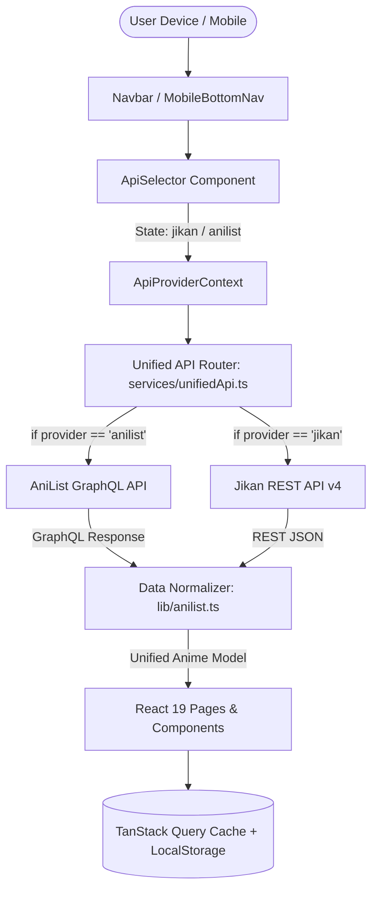

# AniMerit ── Premium Anime Discovery Platform

<div align="center">


[](https://nextjs.org/)
[](https://react.dev/)
[](https://www.typescriptlang.org/)
[](https://tailwindcss.com/)
[](https://anilist.co/)
[](https://jikan.moe/)

**An elegant, ultra-fast, modern anime discovery platform combining AniList, Netflix, and Apple design aesthetics into a seamless web experience.**

[Features](#-key-features) • [Dual API System](#-dual-api-provider-system) • [Tech Stack](#-tech-stack) • [Installation](#-getting-started) • [Architecture](#-architecture)

</div>

---

## 🌟 Overview

**AniMerit** is a state-of-the-art anime discovery web application built from scratch with **Next.js 15 (App Router)**, **React 19**, **TypeScript**, **Tailwind CSS**, and **TanStack Query**. 

Designed for anime fans who value speed, beauty, and rich metadata, **AniMerit** offers instant switching between **AniList GraphQL** and **Jikan REST API v4**, responsive phone touch navigation, dynamic accent theme switching with Web Audio synth feedback, and offline fallback resiliency.

---

## ✨ Key Features

### 📡 1. Dual API Data Provider Switcher
- **Live Provider Toggle**: Switch seamlessly between **Jikan REST API v4** (MyAnimeList) and **AniList GraphQL API** directly from the top navigation bar or settings page.
- **Data Normalization Layer**: Unified TypeScript schema maps both GraphQL and REST data models into a single frictionless UI contract.
- **Offline Resiliency**: Built-in fallback datasets serve curated top anime, airing series, movies, and seasonal titles during API downtime or rate-limiting.

### 📱 2. Smartphone & Mobile Optimization
- **Sticky Glassmorphic Mobile Bottom Nav**: Dedicated bottom bar for single-thumb navigation (`Home`, `Top`, `Airing`, `Search`, `Library`).
- **Touch Manipulation**: Configured `touch-action: manipulation` and `-webkit-tap-highlight-color` for fast, responsive touch response on mobile browsers.
- **Dynamic Poster Aspect Ratios**: Choose between Compact (`3:4`), Balanced (`2:3`), and Tall (`2:3.2`) card sizes.

### 🎨 3. Rich Aesthetics & Theme Customizer
- **Dark Mode Palette**: Deep midnight `#09090B` background with glassmorphism panels, glowing radial backdrops, and gradient borders.
- **Dynamic Primary Accent Tinting**: Switch between **Electric Cyan (`#06B6D4`)**, **Crimson Rose (`#F43F5E`)**, **Azure Blue (`#0284C7`)**, **Emerald Green (`#10B981`)**, and **Golden Amber (`#F59E0B`)**.
- **Web Audio FX**: Subtle synth audio feedback on button clicks, hover, toggle, and favorite actions.

### 🔍 4. Discovery & Instant Search
- **Instant Search Engine (`Ctrl + K`)**: Debounced search (300ms) with query params sync, recent searches local storage, and format/status filters.
- **Featured Hero Banner Carousel**: Auto-sliding hero showcasing trending series with trailer modal triggers.
- **Hall of Fame (`/top`)**: Browse highest rated anime by format (TV, Movie, OVA, ONA, Special) and sort criteria.
- **Live Broadcast Schedule (`/airing`)**: Active weekly broadcasting series.
- **Cinematic Showcase (`/movies`)**: High-rated feature films.
- **Seasonal Archive (`/seasonal`)**: Year selector (1990 - 2026) and season archive (Winter, Spring, Summer, Fall).
- **Anime Roulette**: Interactive spin-to-discover random anime picker modal.

### 💖 5. Personal Library & Character Profiles
- **Favorites Storage**: Save favorite anime series and character profiles stored in `localStorage`.
- **Library Export & Restore**: Backup saved library collections as JSON files.
- **Character Profiles (`/character/[id]`)**: Japanese kanji names, biography, member favorites, voice actors (Seiyuu), and anime appearance roles.

---

## 🛠 Tech Stack

| Category | Technology |
| :--- | :--- |
| **Framework** | [Next.js 15](https://nextjs.org/) (App Router & Turbopack) |
| **UI Library** | [React 19](https://react.dev/) |
| **Language** | [TypeScript](https://www.typescriptlang.org/) |
| **Styling** | [Tailwind CSS v4](https://tailwindcss.com/) + Glassmorphism utilities |
| **State & Fetching** | [TanStack Query v5](https://tanstack.com/query) + [Axios](https://axios-http.com/) |
| **Animations** | [Framer Motion](https://www.framer.com/motion/) |
| **Icons** | [Lucide React](https://lucide.dev/) |
| **API Endpoints** | [AniList GraphQL API](https://anilist.co/) & [Jikan REST API v4](https://jikan.moe/) |

---

## 🏗 Architecture



---

## 🚀 Getting Started

### Prerequisites
- **Node.js**: `v18.17` or higher
- **npm** or **yarn** / **pnpm** / **bun**

### Installation

1. **Clone the repository**:
   ```bash
   git clone https://github.com/IshtiAK47/AniMerit.git
   cd AniMerit
   ```

2. **Install dependencies**:
   ```bash
   npm install
   ```

3. **Run the development server**:
   ```bash
   npm run dev
   ```

4. **Open in browser**:
   Navigate to [http://localhost:3000](http://localhost:3000)

### Production Build

To build the project for production:
```bash
npm run build
npm run start
```

---

## 📂 Project Structure

```
AniMerit/
├── app/
│   ├── layout.tsx            # App root layout, Providers, Navbar, Footer
│   ├── page.tsx              # Home Page (Hero Carousel, Top 10, Airing, Movies, Seasonal)
│   ├── top/page.tsx          # Top Rated Anime Hall of Fame
│   ├── airing/page.tsx       # Currently Airing Schedule
│   ├── movies/page.tsx       # Masterpiece Anime Movies
│   ├── seasonal/page.tsx     # Seasonal Archive (1990 - 2026)
│   ├── search/page.tsx       # Search Engine Page
│   ├── favorites/page.tsx    # Saved Library & Export/Import
│   ├── settings/page.tsx     # App Preferences (API Source, Accent Colors, Density, Sound)
│   ├── anime/[id]/page.tsx   # Detailed Anime View
│   └── character/[id]/page.tsx # Character Profile View
├── components/
│   ├── layout/               # Navbar, MobileBottomNav, Footer, BackgroundBlobs, ScrollProgress
│   └── ui/                   # AnimeCard, CharacterCard, HeroCarousel, SearchModal, ApiSelector...
├── providers/
│   ├── ApiProviderContext.tsx # Jikan vs AniList API Switcher Context
│   ├── ThemeProvider.tsx      # Accent Colors, Density, Web Audio Synth
│   ├── FavoritesProvider.tsx  # Favorites LocalStorage Management
│   └── QueryProvider.tsx      # TanStack Query Config
├── services/
│   ├── unifiedApi.ts          # Unified API Router
│   ├── anilistApi.ts          # AniList GraphQL Services
│   └── jikanApi.ts            # Jikan REST Services & Offline Fallbacks
├── lib/
│   ├── anilist.ts             # AniList GraphQL Client & Transformer
│   └── jikan.ts               # Jikan Rate-Limiter Queue
└── public/                    # Static Assets
```

---

## 🤝 Contributing

Contributions, issues, and feature requests are welcome! Feel free to check the [issues page](https://github.com/IshtiAK47/AniMerit/issues).

---

## 📄 License

Distributed under the MIT License. See `LICENSE` for more information.

<div align="center">

Crafted with ❤️ for anime fans worldwide by [IshtiAK47](https://github.com/IshtiAK47)

</div>
